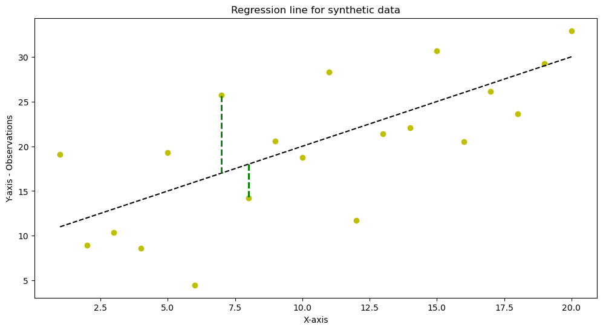
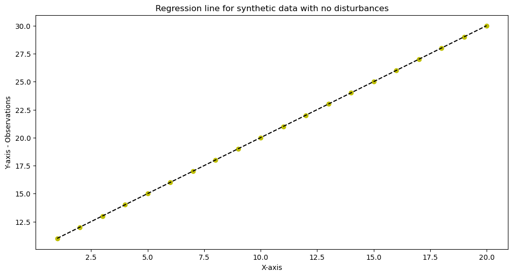
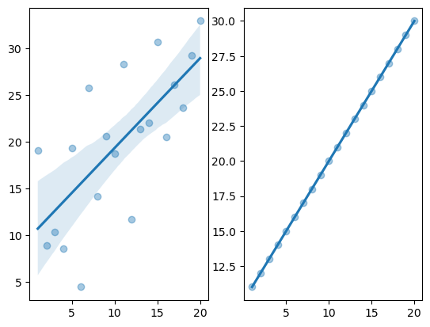
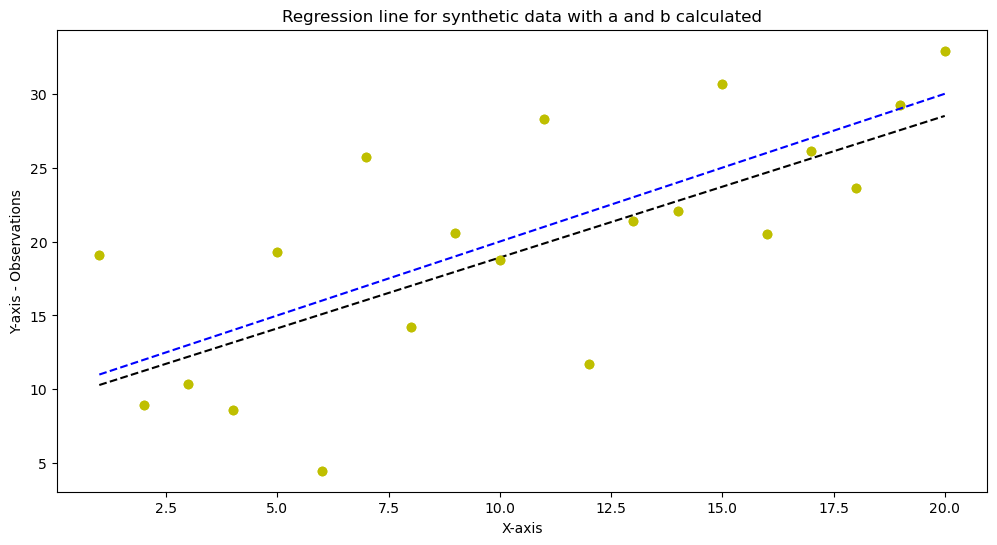
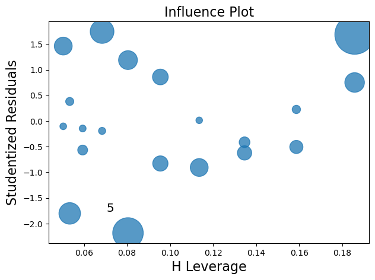
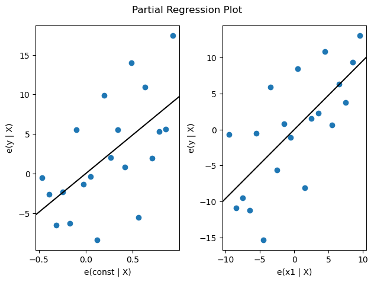
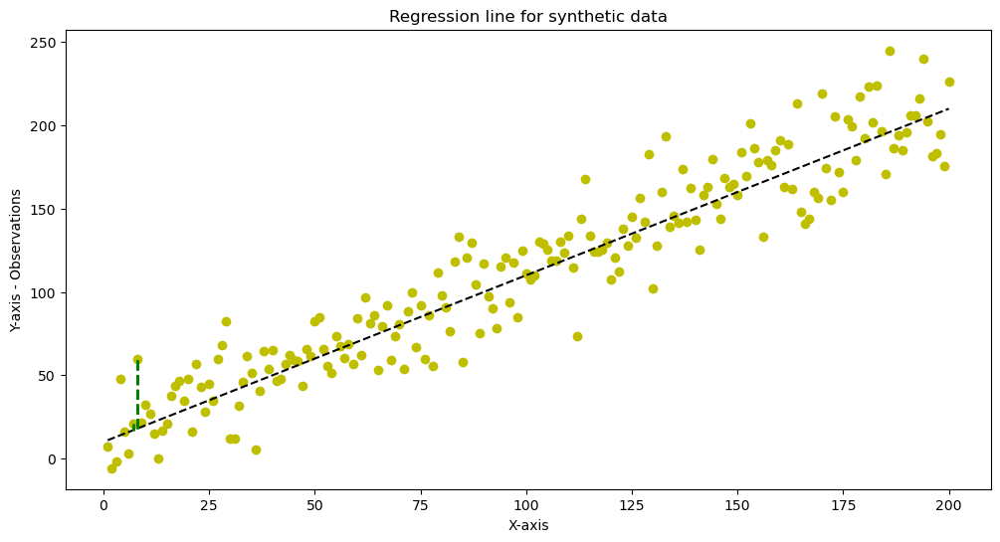

<h1>Least Square regression with simulated (synthetic data) reverse procedure</h1>


```python
import pandas as pd
import numpy as np
from numpy.random import seed
from numpy.random import normal
from sklearn.linear_model import LinearRegression

```


```python
#visualization libraries
import matplotlib.pyplot as plt
%matplotlib inline
import matplotlib.pyplot as plt
import seaborn as sns
```

We will be experimenting with synthetic data to develop the least square approximations on the reverse.  
Our equation of the linear model: 
<p>$$y_{i}=α + βx_{i} + ε_{i} (i=1,....,n)(1)$$</p>  

We are going to create synthetic data for a number of observations say $n$ and we will simulate our experiment to find a and b. 
<p>We choose a constant term -$a$ say $a=10$ and a slope coefficient -$b$ say, $b=1$. We will generate $n$ random disturbances $e_{1},.... e_{n}$ from a normal distribution with mean zero and variance $σ^2=25$ so, $σ=5$. </p>


```python
#define our parameters a and b - sigma is the variance n is the number of observations
a=10; b=1; sigma=5; n=20
```


```python
#define seed with 1 to make the experiment repeatable with same data
seed(1)
#Generate a sequence of n disturbances 
e = normal(loc=0, scale=1, size=n)
e
```


    array([ 1.62434536, -0.61175641, -0.52817175, -1.07296862,  0.86540763,
           -2.3015387 ,  1.74481176, -0.7612069 ,  0.3190391 , -0.24937038,
            1.46210794, -2.06014071, -0.3224172 , -0.38405435,  1.13376944,
           -1.09989127, -0.17242821, -0.87785842,  0.04221375,  0.58281521])


Apply a variance of 5 to disturbances 
We multiply the random normally distributed disturbances by variance sigma.  


```python
EPS1=e*sigma
EPS1
```


    array([  8.12172682,  -3.05878207,  -2.64085876,  -5.36484311,
             4.32703815, -11.50769348,   8.72405882,  -3.8060345 ,
             1.59519548,  -1.24685188,   7.31053969, -10.30070355,
            -1.61208602,  -1.92027177,   5.66884721,  -5.49945634,
            -0.86214104,  -4.38929209,   0.21106873,   2.91407607])


```python
#Here we define our explained variable X of the equation 1
X=np.arange(1,n+1)

print(" The explanatory variable : " , X)
```

     The explanatory variable :  [ 1  2  3  4  5  6  7  8  9 10 11 12 13 14 15 16 17 18 19 20]
    


```python
#We are developing equation (1) α+βx
YSYS=a+b*X
YSYS
```


    array([11, 12, 13, 14, 15, 16, 17, 18, 19, 20, 21, 22, 23, 24, 25, 26, 27,
           28, 29, 30])


>Data Y, are generated with disturbances ε~$N(0, 25)$ by the equation $y_{i}=α + βx_{i} + ε_{i} (i=1,....,n)$ <br> 
with $n=20, x_{i}=i$ with $i=1,...n, α=10$ and $β=1$


```python
Y=YSYS+EPS1
Y #this is our data explanatory variable 
```


    array([19.12172682,  8.94121793, 10.35914124,  8.63515689, 19.32703815,
            4.49230652, 25.72405882, 14.1939655 , 20.59519548, 18.75314812,
           28.31053969, 11.69929645, 21.38791398, 22.07972823, 30.66884721,
           20.50054366, 26.13785896, 23.61070791, 29.21106873, 32.91407607])


```python
Y[7]

X[7]
```


    8


Now we have finished with the data generation process. Let's now display the "fitted" line and the data. 


```python
fig = plt.figure(figsize=(12,6))  #setting the figure size
plt.title('Regression line for synthetic data')
plt.xlabel('X-axis')
plt.ylabel('Y-axis - Observations')
plt.plot(X, Y, 'yo', X, b*X+a, '--k')
plt.plot([X[7],X[7]], [18, Y[7]],color='green',linestyle='dashed',linewidth=2)
plt.plot([X[7],X[7]], [18, Y[7]],color='green',linestyle='dashed',linewidth=2, label="ei")
plt.plot([X[6],X[6]], [17, Y[6]],color='green',linestyle='dashed',linewidth=2, label="ei")
plt.show()
```


    

    


Above: Scatter diagram with observed (synthetic) data $({x}_i, {y}_i)$, regression line $(y_{i}=α + βx_{i})$, and
residual $({e}_i)$.


```python
t=a+b*X
```


```python
t
```


    array([11, 12, 13, 14, 15, 16, 17, 18, 19, 20, 21, 22, 23, 24, 25, 26, 27,
           28, 29, 30])


```python
fig = plt.figure(figsize=(12,6))  #setting the figure size
plt.title('Regression line for synthetic data with no disturbances')
plt.xlabel('X-axis')
plt.ylabel('Y-axis - Observations')
plt.plot(X, t, 'yo', X, b*X+a, '--k')
plt.show()
```


    

    


```python
fig, ax = plt.subplots(1, 2)
sns.regplot(X, Y, ax=ax[0], scatter_kws={'alpha': 0.4})
sns.regplot(X, t, ax=ax[1], scatter_kws={'alpha': 0.4})
```

    C:\Users\ippok\conda3\lib\site-packages\seaborn\_decorators.py:36: FutureWarning: Pass the following variables as keyword args: x, y. From version 0.12, the only valid positional argument will be `data`, and passing other arguments without an explicit keyword will result in an error or misinterpretation.
      warnings.warn(
    


    <AxesSubplot:>


    

    


<H1>The Reverse procedure</H1>

>Now we will be taking the reverse procedure to verify and confirm the parameters a and b.<br>
Suppose we are given the data X and Y above and we were asked to calculate the parameters a and b and display the fitted line. 

So, our purpose is to find a and b that minimize the square difference<br><br> 
$$S(a, b)=\sum({y}_i-a-b{x}_i^2)$$

We derive the partial derivatives with respect to a and b and equate to zero <br><br>
$$\partial S/\partial α =-2\sum({y}_i-a-b{x}_i)=0$$
$$\partial S/\partial β =-2\sum{x}_i({y}_i-a-b{x}_i)=0$$
<br>


Dividing by <b>2n</b> finally we find $$a=\hat{y}-b\hat{x}$$<br>


$$b=\frac{\sum ({x}_i-\hat{x})({y}_i-\hat{y})}{\sum ({x}_i-\hat{x})^2}$$</p>


We can further simplify our fraction for b as folows:<br>
$$\sum ({x}_i-\hat{x})({y}_i-\hat{y})=\sum ({x}_i{y}_i)-\frac{1}{n}\sum {x}_i\sum {y}_i$$
$$\sum ({x}_i-\hat{x})^2=\sum {x}_i^2-\frac{1}{n}\Biggl(\sum {x}_i\Biggr)^2$$


```python
#calculate the mean for x and y 
x_mean=np.mean(X)
y_mean=np.mean(Y)
```


```python
#Calculate Σxi and Σyi
Sx=np.sum(X)
Sy=np.sum(Y)
#Square X and Y
X_sq=X**2
Y_sq=Y**2
#Calculate Σxiyi
Sxy=np.dot(X, Y.T)
```


```python
X_sq
```


    array([  1,   4,   9,  16,  25,  36,  49,  64,  81, 100, 121, 144, 169,
           196, 225, 256, 289, 324, 361, 400], dtype=int32)


```python
Y_sq
```


    array([ 365.64043651,   79.9453781 ,  107.3118072 ,   74.5659345 ,
            373.53440352,   20.18081783,  661.72720223,  201.46865649,
            424.16207687,  351.68056451,  801.48665727,  136.87353748,
            457.44286441,  487.51439856,  940.57818929,  420.2722905 ,
            683.18767113,  557.46552803,  853.28653656, 1083.33640345])


```python
X_sum_sq=np.sum(X_sq)
Y_sum_sq=np.sum(Y_sq)
```


```python
print (X_sum_sq)
print (Y_sum_sq)
```

    2870
    9081.661354455558
    


```python
Sy
```


    396.6635363539271


```python
#Our nominator is
nom=Sxy-((Sx*Sy)/20)
print (nom)
```

    637.388638050521
    


```python
#Our dennominator is
den=X_sum_sq-(1/n)*(Sx)**2
print (den)
```

    665.0
    


```python
#And we finally find b
b_c=nom/den
print ("parameter b is", b_c)
```

    parameter b is 0.9584791549631895
    


```python
#And we find a as well
alpha=np.mean(Y)-b*np.mean(X)
print ("parameter a is", alpha)
```

    parameter a is 9.333176817696355
    

So, we calculated manually the regression line parameters and found them as;
$$a +\beta x=9.333176817696355+0.9584791549631895x$$
Which is very close to our initial given values of $a=10$ and $\beta =1$


```python
fig = plt.figure(figsize=(12,6))  #setting the figure size
plt.title('Regression line for synthetic data with a and b calculated')
plt.xlabel('X-axis')
plt.ylabel('Y-axis - Observations')
plt.plot(X, Y, 'yo', X, b_c*X+alpha, '--k')
plt.plot(X, Y, 'yo', X, b*X+a, '--b')
plt.show()
```


    

    


```python
import statsmodels.api as sm
X = sm.add_constant(X)
```


```python
#A different way obtaining LS regression through the package 
model = sm.OLS(Y,X)
results = model.fit()
results.params
```


    array([9.76914569, 0.95847915])


```python
#add the constant 
X
```


    array([[ 1.,  1.],
           [ 1.,  2.],
           [ 1.,  3.],
           [ 1.,  4.],
           [ 1.,  5.],
           [ 1.,  6.],
           [ 1.,  7.],
           [ 1.,  8.],
           [ 1.,  9.],
           [ 1., 10.],
           [ 1., 11.],
           [ 1., 12.],
           [ 1., 13.],
           [ 1., 14.],
           [ 1., 15.],
           [ 1., 16.],
           [ 1., 17.],
           [ 1., 18.],
           [ 1., 19.],
           [ 1., 20.]])


```python
results.summary()
```


<table class="simpletable">
<caption>OLS Regression Results</caption>
<tr>
  <th>Dep. Variable:</th>            <td>y</td>        <th>  R-squared:         </th> <td>   0.503</td>
</tr>
<tr>
  <th>Model:</th>                   <td>OLS</td>       <th>  Adj. R-squared:    </th> <td>   0.475</td>
</tr>
<tr>
  <th>Method:</th>             <td>Least Squares</td>  <th>  F-statistic:       </th> <td>   18.22</td>
</tr>
<tr>
  <th>Date:</th>             <td>Sun, 04 Dec 2022</td> <th>  Prob (F-statistic):</th> <td>0.000463</td>
</tr>
<tr>
  <th>Time:</th>                 <td>12:10:45</td>     <th>  Log-Likelihood:    </th> <td> -62.451</td>
</tr>
<tr>
  <th>No. Observations:</th>      <td>    20</td>      <th>  AIC:               </th> <td>   128.9</td>
</tr>
<tr>
  <th>Df Residuals:</th>          <td>    18</td>      <th>  BIC:               </th> <td>   130.9</td>
</tr>
<tr>
  <th>Df Model:</th>              <td>     1</td>      <th>                     </th>     <td> </td>   
</tr>
<tr>
  <th>Covariance Type:</th>      <td>nonrobust</td>    <th>                     </th>     <td> </td>   
</tr>
</table>
<table class="simpletable">
<tr>
    <td></td>       <th>coef</th>     <th>std err</th>      <th>t</th>      <th>P>|t|</th>  <th>[0.025</th>    <th>0.975]</th>  
</tr>
<tr>
  <th>const</th> <td>    9.7691</td> <td>    2.690</td> <td>    3.632</td> <td> 0.002</td> <td>    4.117</td> <td>   15.421</td>
</tr>
<tr>
  <th>x1</th>    <td>    0.9585</td> <td>    0.225</td> <td>    4.268</td> <td> 0.000</td> <td>    0.487</td> <td>    1.430</td>
</tr>
</table>
<table class="simpletable">
<tr>
  <th>Omnibus:</th>       <td> 0.100</td> <th>  Durbin-Watson:     </th> <td>   2.956</td>
</tr>
<tr>
  <th>Prob(Omnibus):</th> <td> 0.951</td> <th>  Jarque-Bera (JB):  </th> <td>   0.322</td>
</tr>
<tr>
  <th>Skew:</th>          <td>-0.058</td> <th>  Prob(JB):          </th> <td>   0.851</td>
</tr>
<tr>
  <th>Kurtosis:</th>      <td> 2.390</td> <th>  Cond. No.          </th> <td>    25.0</td>
</tr>
</table><br/><br/>Notes:<br/>[1] Standard Errors assume that the covariance matrix of the errors is correctly specified.


```python
fig = sm.graphics.influence_plot(results, criterion="cooks")
fig.tight_layout(pad=1.0)
```


    

    


```python
fig = sm.graphics.plot_partregress_grid(results)
fig.tight_layout(pad=1.0)
```

    eval_env: 1
    eval_env: 1
    


    

    


```python
def make_regression(var, obs, a, b):
    #define seed with 1 to make the experiment repeatable with same data
    #seed(1)
    #Generate a sequence of n disturbances 
    e = normal(loc=0, scale=1, size=obs)
    EPS1=e*var
    X=np.arange(1,obs+1)
    #We are developing equation (1) α+βx
    YSYS=a+b*X
    Y=YSYS+EPS1
    Y #this is our data explanatory variable 
    return X, Y
   
```


```python
(X, Y)=make_regression(5, 20, 10, 1)
Y
```


    array([ 5.49690411, 17.72361855, 17.5079536 , 16.51247169, 19.50427975,
           12.5813607 , 16.38554887, 13.32115283, 17.6605596 , 22.65177733,
           17.54169624, 20.01623237, 19.5641365 , 19.77397179, 21.64376935,
           25.93667701, 21.41344826, 29.17207849, 37.29901089, 33.7102208 ])


```python
(X, Y)=make_regression(20, 200, 10, 1)
fig = plt.figure(figsize=(12,6))  #setting the figure size
plt.title('Regression line for synthetic data')
plt.xlabel('X-axis')
plt.ylabel('Y-axis - Observations')
plt.plot(X, Y, 'yo', X, b*X+a, '--k')
plt.plot([X[7],X[7]], [18, Y[7]],color='green',linestyle='dashed',linewidth=2)
plt.plot([X[7],X[7]], [18, Y[7]],color='green',linestyle='dashed',linewidth=2, label="ei")
plt.plot([X[6],X[6]], [17, Y[6]],color='green',linestyle='dashed',linewidth=2, label="ei")
plt.show()
```


    

    


```python
def find_reg_params(X, Y):
    #calculate the mean for x and y 
    x_mean=np.mean(X)
    y_mean=np.mean(Y)
    #Calculate Σxi and Σyi
    Sx=np.sum(X)
    Sy=np.sum(Y)
    #Square X and Y
    X_sq=X**2
    Y_sq=Y**2
    #Calculate Σxiyi
    Sxy=np.dot(X, Y.T)
    X_sum_sq=np.sum(X_sq)
    Y_sum_sq=np.sum(Y_sq)
    #Our nominator is
    nom=Sxy-((Sx*Sy)/20)
    #print (nom)
    #Our dennominator is
    den=X_sum_sq-((1/n)*(Sx)**2)
    #print (den)
    #And we finally find b
    beta=nom/den
    #print ("calculated parameter b is", b_c)
    #And we find a as well
    alpha=np.mean(Y)-b*np.mean(X)
    #print ("calculated parameter a is", alpha)
    return alpha, beta
```


```python
(X_g, Y_g)=make_regression(5, 20, 10, 1)
(a_c,b_c)=find_reg_params(X_g, Y_g)
```


```python
a_c
```


    9.65889564621526


```python
b_c
```


    1.1943043572074181


```python
a_val=np.zeros(20001)
b_val=np.zeros(20001)
for i in range(20001):
    (X_gen,Y_gen)=make_regression(5, 20, 10, 1)
    (a_val[i],b_val[i]) = find_reg_params(X_gen, Y_gen)
    
```


```python
np.mean(b_val)
```


    0.9978999547640849


```python
np.mean(a_val)
```


    10.007471725309133


```python
a200_val=np.zeros(20001)
b200_val=np.zeros(20001)
for i in range(20001):
    (X_gen200,Y_gen200)=make_regression(50, 200, 10, 1)
    (a200_val[i],b200_val[i]) = find_reg_params(X_gen200, Y_gen200)
```


```python
print ("the mean value a found after 2000 simulations of 200 observations is ",np.mean(a200_val))
print ("the mean value b found after 2000 simulations of 200 observations is", np.mean(b200_val))       
```

    the mean value a found after 2000 simulations of 200 observations is  9.999919298826718
    the mean value b found after 2000 simulations of 200 observations is 1.1032940993181255
    


```python

```
