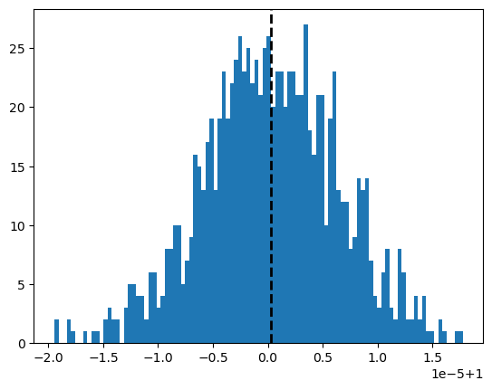

```python
import pandas as pd
import numpy as np
%run ./LSR_lib.ipynb
from numpy.random import seed
from numpy.random import normal
from sklearn.linear_model import LinearRegression
```


```python
#visualization libraries
import matplotlib.pyplot as plt
%matplotlib inline
import matplotlib.pyplot as plt
import seaborn as sns
from scipy.stats import norm
import statistics
```


```python
mu, sigma = 0, 0.1 # mean and standard deviation
s = np.random.normal(mu, sigma, 1000)
s
```


    array([ 0.01173928, -0.09899406,  0.02253498,  0.01143492, -0.1742929 ,
           -0.00483461, -0.19798575, -0.16148333,  0.07154156, -0.03568043,
           -0.0818214 ,  0.08519109, -0.05090659,  0.05979477, -0.06117617,
            0.06728091, -0.06366026,  0.21376828, -0.22988581, -0.01341677,
            0.02481802,  0.13983636, -0.00883665, -0.09248285,  0.04600166,
           -0.05267569,  0.00240888, -0.11815733, -0.21405149,  0.06783767,
            0.16644416,  0.07801735,  0.07528459, -0.07458124,  0.03793171,
           -0.11817609,  0.03299525, -0.04200863,  0.00577534, -0.13261627,
            0.12041221,  0.01092945, -0.02659286,  0.01637991,  0.14771841,
           -0.03536261,  0.0657382 ,  0.10177605, -0.12832623,  0.16596822,
           -0.11158681, -0.04721983,  0.09911993, -0.03264131, -0.03104064,
            0.02666113, -0.16618451, -0.10470263,  0.05813258,  0.02188151,
           -0.25194779, -0.11552396, -0.0370825 ,  0.11250087,  0.03041555,
            0.00265984,  0.11703595,  0.10567907,  0.02709915, -0.10188847,
            0.17458424, -0.07808129, -0.06383862, -0.02190165, -0.11260325,
           -0.02817514,  0.03768077,  0.01490801,  0.17615846, -0.04351666,
            0.01576516,  0.06740508, -0.15234996, -0.03393862,  0.10794526,
            0.08956481,  0.03486569,  0.18823143, -0.15366977,  0.06285121,
            0.04562333, -0.14670125,  0.07752661, -0.17613018, -0.06092576,
            0.01953039, -0.15800455,  0.02101566,  0.26285291,  0.14386023,
           -0.00784578,  0.0364845 ,  0.21602298,  0.06986495, -0.14857543,
            0.14280575,  0.04170289,  0.09520878,  0.03817271,  0.03339676,
            0.02836875, -0.07944553,  0.0112631 ,  0.01208666,  0.12537036,
            0.03858258,  0.0301003 , -0.09908676, -0.14611818,  0.05850762,
           -0.03539274, -0.09408518,  0.05941556, -0.11651015, -0.09267611,
           -0.11457094,  0.02847519, -0.0316173 , -0.06251545,  0.1506707 ,
           -0.00879427,  0.04451493,  0.29060089,  0.23336212,  0.00704583,
            0.04005396, -0.04956916,  0.14271141,  0.08917033, -0.00804278,
            0.12272613,  0.03289265,  0.19411368,  0.00514601,  0.0040502 ,
           -0.10897791,  0.09518322, -0.18253908, -0.01005634, -0.04876841,
            0.24175517,  0.01927185,  0.14192769, -0.14281606, -0.13451072,
            0.11017969,  0.02457658,  0.07645741,  0.11600845, -0.12226494,
            0.00352043,  0.09450379, -0.05373112,  0.03271606,  0.01570372,
            0.11173749,  0.07195157, -0.0035528 , -0.15285485,  0.13694182,
           -0.03595007, -0.05531196,  0.18227397, -0.04021251, -0.11050279,
            0.11003084, -0.05029842, -0.02541808,  0.00931667, -0.24489286,
           -0.14650215, -0.06333486, -0.04139611,  0.04658874, -0.1426908 ,
           -0.07910899,  0.0374072 , -0.03991204, -0.1203806 , -0.14256356,
           -0.13363553,  0.10911805,  0.00047226,  0.16802429,  0.19359793,
           -0.00055198,  0.00153995,  0.06892139, -0.10254928,  0.11797256,
            0.04864238, -0.05933821,  0.04873772, -0.00693873,  0.22559977,
           -0.04322864,  0.12375821,  0.04713302, -0.01041769, -0.10598038,
            0.10877372, -0.04928628,  0.05674575, -0.07459477, -0.0363496 ,
           -0.03414815, -0.01714546,  0.13609123, -0.00573377, -0.03989005,
           -0.07215335,  0.00292692,  0.14066092,  0.05656279,  0.08624573,
           -0.01835972,  0.09109974,  0.0481265 ,  0.00698548, -0.02733486,
           -0.0482216 , -0.16744657, -0.0745592 ,  0.07556884, -0.08979914,
            0.18966672,  0.00306843, -0.0514065 , -0.12010689, -0.0043723 ,
           -0.11862682, -0.12845448, -0.00830745,  0.08130757, -0.07055084,
           -0.01755085, -0.17520686, -0.06789189,  0.31400937, -0.02693274,
            0.01430182,  0.07729852, -0.03382063,  0.04488075,  0.09069812,
           -0.04850992, -0.11747584, -0.25187999,  0.04786483, -0.02018519,
            0.01010156,  0.15672126, -0.07671964, -0.10080513,  0.05833577,
           -0.07012434, -0.12631583, -0.08249161, -0.18474039, -0.08242821,
           -0.02220135, -0.17265675, -0.06040827, -0.1274954 ,  0.12830601,
           -0.05940716,  0.0296685 ,  0.01809089, -0.0047276 , -0.01412833,
           -0.03376052, -0.00220467,  0.0896043 , -0.06565177, -0.00176745,
            0.21240312,  0.06398198,  0.08054382,  0.03161373, -0.04097015,
           -0.01009485,  0.01990013, -0.00328994, -0.12551795,  0.18398905,
           -0.07806931,  0.1871115 ,  0.10852885, -0.04914624,  0.12714988,
            0.05005404,  0.00959017, -0.0718404 ,  0.10575864,  0.12760497,
           -0.10190164,  0.01068034,  0.07894453, -0.05279098,  0.04319969,
            0.05668885, -0.16875851,  0.01121845,  0.11090944,  0.19076996,
           -0.00452151,  0.01148645, -0.03760792, -0.19670952, -0.00334141,
            0.31454735, -0.02196052,  0.10761828,  0.08413755, -0.04789727,
            0.07617319, -0.09393909,  0.01558599, -0.13290244, -0.03974937,
            0.05073098, -0.12471325,  0.01005739,  0.06933177,  0.06292757,
            0.23919153,  0.03464898,  0.16902107, -0.03484715,  0.09378167,
            0.03975047, -0.08043115,  0.05204896,  0.15215936, -0.07738358,
            0.14232844, -0.0062812 ,  0.02936021,  0.08445709, -0.0746629 ,
           -0.15517661,  0.24121499,  0.16008437,  0.0169758 , -0.15930625,
            0.1679067 , -0.12890327,  0.12671187, -0.06022233,  0.10741767,
           -0.00598692,  0.12230441, -0.17254865,  0.06748632,  0.06669308,
           -0.10663604,  0.09947886,  0.06516351,  0.18378302, -0.18341615,
           -0.00404515, -0.06913546, -0.05169193,  0.14344829, -0.12571619,
            0.04033545,  0.13900625,  0.01857922,  0.05115491, -0.22718503,
           -0.09215612, -0.03898946,  0.14581112,  0.03115227,  0.00428284,
           -0.20123321, -0.0214273 , -0.14743495,  0.07816475,  0.03324611,
           -0.08930446, -0.10721989,  0.11478345,  0.11005957,  0.03858176,
            0.11741504, -0.0461213 , -0.26519461, -0.04030126,  0.13063644,
           -0.07480736, -0.12220819, -0.06018088,  0.11968676,  0.02156557,
            0.01810216, -0.27657139, -0.04370717,  0.04323294, -0.04207332,
           -0.10733801, -0.11439185,  0.11786161, -0.062449  ,  0.06958119,
            0.10353349, -0.0052875 ,  0.15316574,  0.00968872, -0.02143204,
            0.13368299,  0.01774215,  0.04838441, -0.06462847, -0.12145824,
           -0.05449499, -0.05817833,  0.01615132,  0.05557265, -0.00513499,
            0.22139052, -0.15881896,  0.05703445,  0.27460802,  0.12468669,
           -0.00867693,  0.0042328 , -0.05595204,  0.2492948 ,  0.06908997,
            0.12111073,  0.10165704,  0.02292693, -0.06582584, -0.09043265,
           -0.12842305,  0.00681461, -0.12044608, -0.07079496, -0.0455257 ,
           -0.11248027,  0.04306942,  0.05311164,  0.17721084,  0.00578951,
           -0.23468751, -0.01123535, -0.03802294, -0.1956255 ,  0.02031172,
            0.08906242,  0.0456699 ,  0.05193296,  0.20144235, -0.16485198,
            0.0683288 ,  0.10512613, -0.10640109, -0.05057108,  0.14739626,
            0.00431289, -0.0681295 , -0.1094132 ,  0.01774967,  0.16578159,
            0.10325131,  0.06853768, -0.06184151, -0.02825797, -0.15474768,
           -0.01597796,  0.10205187, -0.02476096, -0.07342659, -0.12869076,
            0.14336062, -0.04472018, -0.07574354,  0.04904899,  0.17353796,
            0.12655858, -0.02537553, -0.06216931, -0.11674924, -0.05028085,
            0.00367928, -0.04555661, -0.02707812, -0.01129481,  0.03384478,
           -0.00722893, -0.12982737, -0.00325316, -0.18661716,  0.0936257 ,
           -0.09275236,  0.08078704,  0.02485949,  0.05599665,  0.07475086,
            0.05595826, -0.00605999, -0.04133161, -0.05651742, -0.02777686,
            0.03576618, -0.03814163, -0.08178583,  0.18268976, -0.06586699,
            0.12941766, -0.05918911,  0.10871909, -0.02360756, -0.03156357,
            0.05188273,  0.14638386, -0.00618767, -0.09012332, -0.08771315,
            0.11261946, -0.00783996, -0.09732888, -0.07281784,  0.02210794,
           -0.1238501 , -0.00988584, -0.07325713,  0.0293303 ,  0.14223919,
            0.02914068,  0.08682011, -0.00770579, -0.04122629, -0.06382654,
            0.06673718, -0.07353997, -0.09661388, -0.22565281,  0.09983787,
            0.00855155, -0.17278441,  0.04857738,  0.12218457, -0.09222701,
           -0.01885115, -0.07821104, -0.08448772, -0.01364992, -0.22734823,
           -0.06301379,  0.10943451,  0.09073197, -0.13476443,  0.05964369,
           -0.02623984, -0.09837902,  0.19727755, -0.16538134, -0.05912104,
           -0.12863003,  0.04540709,  0.03211319, -0.05369935, -0.0410476 ,
           -0.09065847,  0.03873187,  0.09284029,  0.01274539,  0.12259208,
           -0.11808715, -0.16878099, -0.06354438, -0.04640527, -0.13168605,
           -0.00800896,  0.10900339,  0.00206414,  0.01791287, -0.13640703,
           -0.02066384, -0.10512114, -0.12302692, -0.02581793, -0.14841922,
            0.03564488,  0.2291799 ,  0.05552789, -0.00691396,  0.13050225,
            0.02474851, -0.03238719, -0.17544613, -0.00656111, -0.14587671,
            0.13243653,  0.05516504,  0.01872464, -0.14920965,  0.10759433,
            0.01843602, -0.09838927, -0.21813454,  0.0048428 ,  0.11236034,
            0.01728322,  0.17272112,  0.15373961,  0.06611452, -0.14909426,
            0.04621346, -0.05924572, -0.13447259, -0.05204112,  0.02301932,
           -0.13042123,  0.01542193, -0.13672783,  0.13906663,  0.0445393 ,
            0.13826489,  0.10807447, -0.00842426, -0.14512462,  0.12878353,
            0.08218876, -0.1278017 ,  0.2660395 ,  0.00548825, -0.12738349,
           -0.02582045, -0.19822718,  0.04767062, -0.09494281,  0.14511252,
           -0.19653688, -0.0039447 ,  0.13683969, -0.02370756, -0.16729048,
           -0.07686661,  0.06020973, -0.16910131,  0.08051107, -0.16322974,
           -0.09744369,  0.16491181,  0.08427438,  0.04997292,  0.11838797,
           -0.17462674, -0.05294511,  0.14910474,  0.13052894, -0.14230289,
           -0.09438616, -0.01228455, -0.05489388,  0.05432047, -0.21654533,
            0.09291581,  0.11516553,  0.0816812 , -0.08579511,  0.06659615,
           -0.1117201 , -0.25497745, -0.20145881,  0.12212179, -0.10844234,
           -0.10569253, -0.16047323,  0.04070712,  0.0878598 , -0.21025521,
            0.06437122, -0.13788503,  0.02253737,  0.00656763,  0.11259235,
           -0.02131012, -0.11764493, -0.00048545,  0.21878097,  0.13839734,
           -0.04997266, -0.09857481,  0.15153129, -0.16371558, -0.03326506,
           -0.02136061,  0.13098741,  0.03565999, -0.14572764, -0.06127808,
            0.13054846,  0.12183443, -0.07449687, -0.08276172, -0.09676621,
            0.02486138,  0.19273316,  0.07576288, -0.0560934 ,  0.20254649,
            0.09389612,  0.057998  ,  0.00596659,  0.16570857,  0.14176227,
            0.090367  ,  0.12882352,  0.03814933,  0.06936876, -0.07191911,
           -0.00939251,  0.03379597, -0.08963018,  0.0253218 , -0.0838917 ,
           -0.04640924,  0.01262603, -0.20189207, -0.19461775, -0.01693719,
           -0.11635836, -0.06947107, -0.05863973, -0.08140174,  0.05994281,
           -0.01644767, -0.0839734 , -0.05570488,  0.11625389, -0.05778475,
            0.14846378, -0.11893019, -0.11686092, -0.04310905, -0.01071223,
           -0.0056264 ,  0.02191627,  0.08283062, -0.13515568, -0.1934679 ,
            0.13271936, -0.03329562, -0.00944944, -0.03934518,  0.0588081 ,
           -0.05861203,  0.03261806, -0.14166705,  0.00251944,  0.07560839,
            0.00804532,  0.02778865, -0.16721128, -0.03252257,  0.06802892,
            0.05377375, -0.04671122,  0.02508139,  0.12232872, -0.14510286,
           -0.12174904, -0.09889689,  0.08517349,  0.00244337, -0.08042427,
            0.08839696, -0.13285633,  0.12745975, -0.19641258,  0.1286032 ,
           -0.05160405,  0.11449618,  0.08053128, -0.06049483, -0.06485121,
            0.09687581,  0.13646505,  0.14775092,  0.14303932, -0.17682414,
            0.04077195, -0.06331057,  0.09460439, -0.09579354, -0.14965472,
           -0.03071642,  0.15495245,  0.11472424, -0.08617821, -0.00047513,
            0.01987441, -0.01873317,  0.01455364, -0.04792676,  0.06439043,
            0.03041969, -0.0198063 , -0.2107645 ,  0.0275136 ,  0.18908042,
           -0.06520029, -0.20005992,  0.08195958, -0.13170427,  0.10061866,
           -0.03906947, -0.00850242,  0.00097777, -0.1289415 , -0.02660194,
            0.08612182,  0.06183833,  0.00535188,  0.05916738, -0.09624232,
           -0.1371848 , -0.03767391, -0.15397825,  0.06413979,  0.08863867,
            0.07810491,  0.13005005, -0.03575942, -0.2105042 ,  0.07926774,
           -0.15589447, -0.04882277,  0.11727191, -0.11276272,  0.05976201,
           -0.01544199,  0.10084064, -0.09090672, -0.0388078 , -0.01070918,
           -0.02106187,  0.04827875,  0.11962947,  0.12739146, -0.04885947,
           -0.05864042,  0.00044127, -0.08614404,  0.16384313, -0.06814079,
            0.01759013, -0.04419011,  0.06060756, -0.22295546,  0.01529663,
           -0.02560567,  0.03603093,  0.10241178, -0.03949059,  0.02106161,
            0.03027123, -0.00666784, -0.04998706,  0.12164597,  0.01021694,
            0.12160249,  0.01815777,  0.03931962,  0.16834212, -0.04452546,
            0.0116318 , -0.04569452, -0.08087725,  0.24439698,  0.01522426,
            0.01802366,  0.05804808,  0.07547163,  0.02931705,  0.0274487 ,
           -0.02209286,  0.03452867, -0.08883341,  0.1579429 ,  0.09290527,
            0.06957715, -0.16717837, -0.01293371, -0.04465435, -0.06713894,
           -0.03345125, -0.11899122, -0.15735517, -0.09246004,  0.11751238,
           -0.10739647, -0.1155996 , -0.07116063, -0.0515088 , -0.04437594,
            0.11806435, -0.00838092,  0.01555335, -0.11676228, -0.0061914 ,
           -0.06342767,  0.1428994 , -0.11654837, -0.00086617, -0.14651862,
            0.00553518, -0.00467583,  0.05622024, -0.04717039, -0.02438521,
           -0.12483857,  0.11435246, -0.09277996, -0.08399381, -0.06167606,
            0.10671016, -0.05976058, -0.02913853,  0.10451202, -0.06913872,
           -0.20931802,  0.05610677, -0.04911156,  0.20467524,  0.08919731,
            0.09115246, -0.02366171,  0.07587991,  0.07497662,  0.01143845,
            0.14780354,  0.01811903, -0.05127837,  0.08494488,  0.02920152,
            0.00978393,  0.03838097, -0.12676316,  0.06651248, -0.08002332,
           -0.07351341,  0.12134501, -0.16766024, -0.15602863,  0.19294654,
            0.1367221 , -0.03662327,  0.00876511, -0.05123712,  0.00784838,
            0.01671043, -0.00215211,  0.13554504,  0.09517593,  0.01721979,
           -0.03565372,  0.06767568,  0.06159467, -0.11617102,  0.11823038,
            0.08102297,  0.00120934, -0.06723837, -0.1550134 , -0.02221324,
            0.17706657, -0.14288634, -0.1410577 ,  0.02234452, -0.04388118,
            0.00964078, -0.17991685,  0.08729108,  0.04044001, -0.02787974,
           -0.02922883, -0.05064453, -0.0727308 ,  0.1064989 , -0.00813205,
            0.00840415,  0.03811216,  0.03301545, -0.1502614 , -0.06597438])


```python
#find the regression parameters a and b based on the X and Y you provide
x = [12,16,71,99,45,27,80,58,4,50]
y = [56,22,37,78,83,55,70,94,12,40]
find_reg_params(x, y)

```


    (31.82863092838909, 0.4950512786062967)


```python
regression(5, 20, 10, 1)
```


    (11.07668097132302, 0.9349042371559384)


```python
#number of simulations
n_sim=1000

#number of observations
obs=20

a=[]
b=[]


for i in range(1, n_sim+1):
    (a_val, b_val)=regression(5, 20000, 10, 1)
    a.append(a_val)
    b.append(b_val)
    
plt.hist(a, 100)
# plotting mean line for parameter a
plt.axvline(np.mean(a), color='k', linestyle='dashed', linewidth=2)
plt.show()

# plotting mean line for parameter b
plt.hist(b, 100)
plt.axvline(np.mean(b), color='k', linestyle='dashed', linewidth=2)
plt.show()

    
```


    

    


    

    


```python
#print the mean results for a and b
print ( "a and b are  ", np.mean(a), np.mean(b))
```

    a and b are   10.001972210821888 0.999999878059471
    


```python
a
```


    [10.028393076354265,
     10.191480560305715,
     9.905656947392226,
     10.043507161290943,
     9.944785829490423,
     10.067198622268439,
     9.998989686059952,
     9.957351656772197,
     9.849367891724407,
     10.045417279835045,
     9.967213169392943,
     9.984556912095846,
     10.004966991363466,
     9.989217702127993,
     10.05428226302415,
     9.9631686271891,
     10.025838895015418,
     10.121058446262778,
     9.93119835948497,
     9.952717538689077,
     10.03638856266141,
     10.029658834680914,
     9.889070048034192,
     9.968130327039956,
     9.964014044891298,
     9.919608253595232,
     10.103639439156652,
     10.105556251838804,
     9.967353939452767,
     10.001031766302884,
     10.022814093735814,
     10.00563922661841,
     10.067125466910005,
     10.042881780509651,
     10.023119264660776,
     10.00294659396261,
     9.998928837692738,
     10.0007654713884,
     9.968014189381897,
     10.130545520073175,
     10.134942643797398,
     9.842086133937539,
     9.968016536404193,
     10.022490654465557,
     9.974263253441453,
     10.0801092641294,
     10.007439005185663,
     10.09308170402199,
     10.075027470698952,
     9.985717946343124,
     10.11460301221758,
     10.133099485595524,
     9.972680353033542,
     9.942718708084524,
     10.005996858988702,
     10.114453357867896,
     10.08564166456312,
     9.92218645786345,
     9.979489960078896,
     10.066859590156376,
     9.971479803183675,
     9.96658943104744,
     10.092724290014804,
     10.013269437363745,
     10.110875794124603,
     9.951502110373974,
     10.061116900381446,
     10.067998297695816,
     10.002759827148914,
     9.985196175536514,
     10.071838512691855,
     10.002039340251685,
     10.028138234122098,
     10.154195390805603,
     10.061767541840673,
     10.033866713494062,
     9.932515350599587,
     10.088577173455059,
     9.982637721812726,
     10.00223601820767,
     9.946444228671492,
     9.964101040126383,
     9.978817609611154,
     9.988412960922718,
     10.075739831994474,
     10.219673139871658,
     9.992926753789186,
     9.97187159307003,
     9.892252605243026,
     10.075964719715714,
     9.97009344549626,
     10.043451030218602,
     10.040463090573251,
     10.021382805100084,
     10.037468101158739,
     9.906845663510262,
     9.966816036078335,
     10.064751091171802,
     9.99806380534023,
     10.013594617673755,
     9.987487921577692,
     9.950127105358243,
     10.07901048373878,
     10.113479551777244,
     9.991674385951459,
     10.059724909724295,
     9.926203395660222,
     9.923379005202651,
     10.069910528737307,
     9.93915995351225,
     10.069881676000357,
     9.920918902152776,
     9.915307111872732,
     10.016502965173125,
     10.143535920217634,
     9.98639346358329,
     9.937845444838702,
     9.865195283204317,
     9.963979569898546,
     10.09384379902035,
     10.08177005867511,
     10.041393232877553,
     9.899056728625297,
     9.893702087490261,
     10.02464497757405,
     9.94616054417789,
     9.864567536391318,
     9.985302989079058,
     9.983264975944161,
     9.916849740546942,
     9.954200475215911,
     9.91675043785125,
     9.98453402697146,
     10.10472930534631,
     9.983508887304366,
     10.044340270398557,
     10.01742839681059,
     9.9969583685413,
     10.003998534375429,
     10.027509446263313,
     10.015008710637689,
     9.99606337555051,
     9.897350098860263,
     9.84051595095843,
     9.852533609253168,
     10.034486948589981,
     9.895674458682537,
     10.011323144927621,
     9.970628502497076,
     10.104277096106111,
     9.97510327423513,
     10.039803036423027,
     9.973440987174213,
     10.093890036274493,
     10.103123723176122,
     9.964626713748276,
     10.045907228751481,
     9.95577067668587,
     9.968613684095443,
     9.941144508631528,
     10.015684889608622,
     10.002266641385853,
     10.040199598565698,
     10.055698772777617,
     10.075589749369025,
     10.078618992911279,
     10.178403539603949,
     10.020197187237441,
     9.891602875313163,
     10.264627097024023,
     9.980651023940743,
     10.289703964737058,
     9.969576468919218,
     10.158687797062099,
     9.897267123571039,
     9.974508960457147,
     10.082543643495441,
     9.987219765366614,
     10.021939104059339,
     10.10003462574184,
     9.94224448209554,
     9.96492770961076,
     9.90897579049915,
     10.016533649161458,
     9.990881529694796,
     9.941573566685618,
     10.088808639134466,
     10.01899388615787,
     10.041527678464353,
     9.87389503543675,
     9.976159595920146,
     9.941297785826027,
     9.984002200309932,
     9.97083260563165,
     9.969982005672156,
     9.89408410244286,
     9.938313565407693,
     9.962564331924915,
     9.993156983104349,
     10.102504318425058,
     10.049744108234346,
     9.98740554370433,
     10.064150050230324,
     9.925770942240954,
     10.04302198740989,
     10.020743647809327,
     9.908916319835186,
     10.021723042027652,
     9.988635540960729,
     9.923478771597146,
     10.077891675443947,
     9.979391647259892,
     9.820998233675956,
     9.974878721678257,
     9.922921683155,
     9.93673652484417,
     10.024436263440549,
     10.007136397752166,
     10.172409528887272,
     9.891047258770465,
     9.880180844174326,
     9.935692042055726,
     10.016224768590927,
     10.048344691228866,
     9.917061220085621,
     9.982491611982882,
     9.971280296617746,
     9.960732532714307,
     10.001667755164206,
     10.042811498704552,
     10.071908255571127,
     9.98783692060262,
     10.02660108179599,
     10.063801745773851,
     9.945771243862808,
     9.986180061522127,
     9.971966583047807,
     9.922424614425003,
     10.12336824698001,
     9.980862560474872,
     10.107484121094645,
     10.138201659327745,
     9.96354627519697,
     10.008538548074663,
     9.974201842932404,
     10.057409383562208,
     10.118562396544219,
     9.892856839337945,
     10.00046566119045,
     9.985808943812549,
     9.965689491842687,
     9.965494012314082,
     9.968133228838443,
     10.12393384964764,
     9.926921773682535,
     10.04135106331408,
     9.921953642304242,
     10.017377764640749,
     10.037827724277973,
     9.999202881549298,
     9.890123831646145,
     9.969306180427969,
     9.930139283317327,
     10.009785726036132,
     9.934762566801906,
     10.078196402648091,
     9.92905100466758,
     9.997535240356624,
     10.000044930575788,
     9.987831943573058,
     10.056879718190432,
     10.112232915614545,
     9.93690959328562,
     10.034258262571692,
     10.01532324616313,
     9.85721494948417,
     9.917177505458891,
     9.925497814680636,
     10.012858325500787,
     9.945121943821013,
     9.95491672526151,
     10.054375019480288,
     10.107638690693676,
     10.049629406239092,
     9.97637605702132,
     9.967143300403654,
     9.94549028042853,
     9.908421861261129,
     10.041132635168731,
     9.849978859511017,
     10.07526345024407,
     10.064186465977132,
     10.100789305485785,
     10.007142707701027,
     9.953336142684519,
     10.021350249205529,
     10.109247336353361,
     9.877012911054493,
     9.996861752548813,
     10.003421959623694,
     9.912989158065617,
     10.126689896142484,
     9.966537073229253,
     10.031473227916658,
     10.0476666677773,
     9.994076126487553,
     9.989197890131175,
     10.003648291158676,
     9.925939834171533,
     10.140474432548881,
     10.014629523921013,
     9.956065858094394,
     9.990510269530118,
     10.018825145946444,
     9.96637173282653,
     10.108211682373286,
     9.998670080670715,
     10.038786733484269,
     10.009714273178577,
     10.024921875753998,
     10.03163336532265,
     10.065846135762333,
     10.013555857144295,
     9.872852486407757,
     10.028793739886583,
     9.870971167290211,
     10.12205465348065,
     10.046820427519084,
     9.998576029063761,
     10.081966748288274,
     10.050673967884482,
     10.096044953900575,
     10.00417932459861,
     10.001651025767625,
     9.995776677300036,
     10.007688494302332,
     10.052799043492973,
     10.04193964690268,
     10.00814847587049,
     9.97782252241373,
     9.883185362935066,
     10.108341169944406,
     9.927229845128954,
     10.052045750573278,
     9.92938660362959,
     9.939319281949103,
     10.036516161039472,
     10.045274565802515,
     9.951605672554672,
     10.18161674375087,
     9.991965653929114,
     9.9486962630108,
     10.06760463566631,
     10.166172131846846,
     10.05000037907064,
     9.982093052506446,
     9.915025158801674,
     9.92309555992335,
     10.079531796821952,
     10.039809289191663,
     9.959902089352905,
     10.120614457954467,
     9.953872379109264,
     10.006752092519402,
     9.960957307243348,
     10.085455616201461,
     9.96529515569061,
     9.979831215560436,
     10.094679825504125,
     10.041125753472745,
     9.94754900650382,
     10.006928538887204,
     10.112838155034185,
     9.933250014074147,
     10.072937666200101,
     9.996232550686598,
     10.059154917579889,
     9.844781539079547,
     10.007386194740235,
     10.067543740019202,
     10.02072521956265,
     10.040685473312438,
     10.030137469086052,
     10.004427979891002,
     9.911725330474972,
     9.990103574165701,
     9.984655034688116,
     9.903152369712293,
     9.959778116638958,
     9.966827843943237,
     9.941331234630942,
     9.940993701608479,
     10.069158492593468,
     10.05337573262453,
     9.948267895281315,
     10.008064247907699,
     10.023987068338693,
     9.985485165476799,
     10.007943640631437,
     9.992753158096969,
     10.159585853783787,
     10.02438851172328,
     10.016456294198335,
     9.940171556364,
     10.007461796344817,
     9.928113066145778,
     9.936807110880315,
     9.931130589219928,
     10.081810280001163,
     9.959321585920453,
     10.038550799256564,
     9.910070799089969,
     10.036824230100214,
     10.024983970269561,
     10.072173262578248,
     10.015203124466538,
     10.081345173479617,
     10.035441776777803,
     9.96528941707313,
     9.918126476645469,
     9.878838285309076,
     10.155908191290498,
     9.900083554357291,
     10.037982952289283,
     9.89932801721841,
     9.965318798235058,
     10.070258543430269,
     9.901321775186062,
     10.16173270741403,
     9.971697480075061,
     9.975752084514498,
     9.802992984925211,
     9.952571794559061,
     9.969914854718745,
     9.949802326352895,
     9.801833143995703,
     10.013107328991591,
     9.948887424463035,
     9.907162573935091,
     10.116076307071745,
     10.009153391924501,
     10.01068615539968,
     10.068858606009185,
     10.023451167692244,
     9.98896607849747,
     9.890907340434193,
     10.003172353126109,
     9.986220981431007,
     10.034466884717345,
     10.051769412961603,
     10.052399167557061,
     9.985418735837936,
     9.967056029045581,
     9.89167077551335,
     10.15366686269641,
     10.069763529749215,
     10.043104174384474,
     9.96879505482018,
     9.924080426755548,
     10.032652813790738,
     9.956176386457681,
     10.077453275373578,
     9.905321072547137,
     9.93435205104053,
     9.895876422064006,
     10.042836178387702,
     9.967012027797104,
     10.059903832058609,
     9.982532551817595,
     10.066377390137315,
     9.80856689425707,
     10.140725425347686,
     9.917031146875024,
     9.975755047409237,
     10.011011129276454,
     9.978660225394368,
     9.987004901318253,
     10.010245391152798,
     10.005561143754422,
     10.067362373693287,
     9.923241551458835,
     9.899372963061928,
     10.028407231146097,
     9.837453061842918,
     10.06999716233164,
     10.102126778389513,
     10.100174867039918,
     10.032140956139564,
     10.008820906634629,
     9.973829022939503,
     9.918183439815044,
     10.030449616391957,
     10.150900801493227,
     9.969359128700196,
     9.946734206143022,
     10.016688769078256,
     10.013962022328377,
     10.03520030862391,
     9.90416440807581,
     10.054254531989992,
     9.988172015240789,
     9.92902810601443,
     10.040138150189817,
     10.055924447602033,
     9.96813288397789,
     9.990817604763805,
     10.040533892321587,
     9.955425679604708,
     9.879416176345945,
     9.870466974370181,
     10.02783633556664,
     10.006096200107038,
     9.969230060072244,
     10.129296323947608,
     9.937911251144111,
     9.989995979079604,
     9.988819382634759,
     9.94666842546612,
     10.06150143443495,
     9.94821788237095,
     10.04185852214843,
     9.947311924842,
     9.857306523013115,
     9.961009760034084,
     9.962629292689265,
     9.994655811133981,
     10.068618143594264,
     10.012337793518602,
     9.880083550666273,
     9.943747157342733,
     9.93884192108661,
     9.991021989156305,
     10.00000435141772,
     9.901009152084589,
     9.9924567834571,
     10.080823057319224,
     9.983931376101076,
     9.947089893461763,
     9.968559454260767,
     10.062402237670124,
     10.069346145564317,
     10.002041747762263,
     9.92716392185092,
     9.944618478432298,
     9.986575086762011,
     10.091235173615813,
     9.935191191232205,
     9.985962632468343,
     9.953545395125449,
     9.995634232750534,
     9.995758664403855,
     9.999115862955152,
     10.05650530281365,
     9.927138946536184,
     10.002777609159052,
     10.030941155439615,
     9.925671353894472,
     10.007480906283856,
     9.938070894953608,
     10.017438195972145,
     10.034974260875583,
     9.960335494568945,
     9.984238608847559,
     9.98695419242531,
     9.927139649501443,
     10.120887177751959,
     9.97560058554858,
     9.788334420259297,
     10.002471753416955,
     10.041716105818749,
     10.112931725355983,
     10.075996454469859,
     10.10134798002243,
     10.035422909107805,
     10.07505894973427,
     10.013216443905234,
     10.12455938026458,
     10.04716010902375,
     10.074583642934263,
     9.970344193464518,
     10.092887060081958,
     10.082412364421785,
     10.041613373610378,
     10.05948679740578,
     10.079805128879846,
     9.986736370317638,
     10.002464545470476,
     10.058834528909623,
     9.996479880334437,
     10.134598560503125,
     9.96966747931987,
     10.029606735904515,
     10.02287884773612,
     10.024309896020592,
     9.992796728479862,
     10.002329353415966,
     10.001122515185177,
     10.080473389148713,
     9.99628703277707,
     10.136496629306674,
     9.97299909221232,
     10.057773353371024,
     9.950356028740108,
     9.927636443397402,
     9.98052935987413,
     10.047052774186433,
     10.085280802124739,
     10.097045136870443,
     9.938206030844151,
     9.913105145969986,
     9.976184561240673,
     10.011041120785475,
     9.99129499438256,
     10.052839688651265,
     10.092157335492969,
     10.05783620416671,
     10.076659151768684,
     9.965639024561643,
     9.928815975882113,
     9.970540715302526,
     9.981009882295131,
     10.017475598619878,
     10.043233485531808,
     10.064485736715794,
     10.077201181998849,
     9.926470479214192,
     9.994013454380632,
     9.958219520142675,
     9.940685800802708,
     10.027886359383166,
     9.989552694253623,
     10.160259318481385,
     10.041377086177468,
     9.84662345662564,
     10.076556697835029,
     9.945103666751086,
     10.12281215607822,
     9.996009937509895,
     10.130684836068749,
     9.978191456758976,
     10.112382357178628,
     10.039970600393415,
     10.095788638627528,
     10.03583847271949,
     10.05486774496585,
     10.028992892065645,
     10.125453118991851,
     9.87769794368148,
     10.109301536907255,
     9.980030835910142,
     10.025915015955269,
     9.955452664105595,
     9.971485484585166,
     9.95229420284778,
     9.941234171159566,
     10.075701352064312,
     10.120013362252712,
     9.983843622840942,
     9.882679002848267,
     10.0084973945871,
     10.062849187229574,
     10.006552871829271,
     10.09280388122797,
     9.995333265714347,
     9.845889762420953,
     9.960949800369143,
     10.082168504483997,
     10.025970586010814,
     10.012633354638517,
     9.985901513376833,
     9.983774463662504,
     9.927020013050734,
     10.002431532347202,
     10.14728183156103,
     9.987853970861435,
     10.02575742944479,
     9.83588473367095,
     10.032535844157636,
     10.015216153836251,
     9.892854958306254,
     10.020407748605312,
     10.046396261060238,
     10.083448775592446,
     9.876563914690912,
     9.99145214535594,
     10.003581001244486,
     9.992236430174112,
     10.044911563898623,
     9.913156067211926,
     10.011804975603521,
     9.981867969587444,
     9.94535707425028,
     10.070807603530586,
     9.952625591304898,
     9.974362474183739,
     10.018897652883828,
     9.851566589713096,
     10.103557159863412,
     9.905776560895145,
     10.028710321737826,
     10.05478323097825,
     9.961784603597224,
     9.946898815824092,
     10.050726216965915,
     10.033103495950996,
     9.996100730642677,
     9.923155786576867,
     10.091950970506668,
     10.011832040420174,
     9.90503545809388,
     10.116361606295406,
     10.037380621428788,
     9.963229360428452,
     10.101849727547169,
     9.950958623589575,
     10.01443883163929,
     10.03613348725587,
     9.857392347598076,
     9.947798129481077,
     9.852374230626225,
     10.081344810135663,
     10.006786586499214,
     9.95018828303069,
     9.904755404670537,
     10.023101742400229,
     9.97885482006669,
     9.86741607696712,
     9.978237235492468,
     9.965576202361285,
     9.942085587967933,
     10.07817654299885,
     9.88784948746562,
     9.933729119996727,
     10.039545290860534,
     10.001172945839167,
     10.00464314392507,
     10.09381418275684,
     10.081298957528174,
     9.894171850180626,
     9.917172911265492,
     9.914725086022914,
     10.160549679929018,
     10.086033338685334,
     9.94223580378443,
     10.062504912549258,
     10.074165533199906,
     10.049789709396661,
     9.89598071397841,
     10.0607486511454,
     10.035967217701673,
     9.952001969717443,
     10.087681356087327,
     9.926532740972936,
     9.921713551320135,
     10.041588349618017,
     9.968728208440542,
     9.857907112018765,
     9.993922085033358,
     10.038151350061595,
     10.162873982051014,
     10.033886048938333,
     9.958966790229082,
     9.957983599603176,
     10.004867076180876,
     10.063985096651315,
     10.062144559665024,
     9.987878064922988,
     10.114990507876874,
     9.985980688251555,
     9.997510568754375,
     9.938419236905872,
     9.927086634919048,
     9.922002432252466,
     10.006439934523403,
     9.926366317023337,
     9.905238191771508,
     9.95700276786834,
     9.955034368143975,
     9.985940298698843,
     9.971649158746004,
     10.144552491800487,
     10.028343831403554,
     10.030548230040074,
     9.963731600242854,
     10.018789495907724,
     10.032232019473613,
     9.993246274673938,
     9.803767455758154,
     10.010928625391424,
     9.97393535169661,
     10.008494319857657,
     9.806854779535533,
     9.948583868095279,
     10.132942230138182,
     10.089475594229997,
     9.932012197050453,
     9.936634937104582,
     9.99056924482733,
     9.989679188965262,
     9.976592091308534,
     10.050200103655458,
     9.929108789676429,
     9.995739119702577,
     10.092499993821978,
     9.88595277479291,
     10.080409712132811,
     9.982570015972852,
     10.065713013471663,
     10.067353976871074,
     10.005527885404229,
     9.918187173289061,
     10.04055646828115,
     9.985647874251008,
     10.11413344976604,
     9.921176642355324,
     9.90598185506165,
     10.020926441314817,
     10.020982736352087,
     9.958993808853625,
     9.879204349252582,
     10.039648283822835,
     9.950077888807654,
     10.02523071052134,
     9.903096278648079,
     10.021915349961818,
     9.892016107566654,
     10.019550524415076,
     9.977923436316848,
     9.968639485973119,
     9.892340948398411,
     10.050138767418265,
     9.938072668868303,
     9.9865002979815,
     9.943697768943013,
     10.076199578568339,
     10.043529248145223,
     10.093477658228576,
     9.902579007424414,
     10.00789672229588,
     9.958116176855563,
     10.075675430373847,
     10.025280980712175,
     9.947458768203855,
     10.033659229558706,
     9.95965411338061,
     10.005775559179485,
     10.003079660828412,
     9.987574051007629,
     10.102099135608972,
     9.892529280403256,
     10.012001403078436,
     9.999271440419555,
     9.968245149950683,
     10.031669324545563,
     10.0141318592906,
     10.138622677889467,
     10.047591210916638,
     9.890076404640078,
     10.05304965159297,
     10.019396029888094,
     10.12630512407571,
     9.892157810017467,
     10.025721801824869,
     10.000581159007549,
     10.034781322595476,
     10.003800254277884,
     10.017056438586115,
     9.977785832750797,
     9.993842301729321,
     10.003371103131771,
     9.99655531628579,
     10.002403837239742,
     10.09927661227137,
     9.952544471646846,
     10.03781198285073,
     10.019910991939902,
     10.002161211112142,
     9.97465685634166,
     9.901018300136924,
     10.084581287188827,
     9.974995803280175,
     10.150113277664781,
     10.117167377214134,
     9.885450488360226,
     9.899478566998244,
     10.139883772370219,
     10.008198156672716,
     10.039468935531378,
     9.939680122500658,
     9.980700383909047,
     10.024535704234243,
     10.02183176048249,
     10.054896893398464,
     10.041265247242153,
     9.908618142025173,
     9.961350717552007,
     10.068613623555004,
     9.968684651653469,
     9.843674613873661,
     10.08029828647375,
     9.96954718543142,
     10.169764146722853,
     9.99741403387934,
     10.034741886472702,
     9.971019430187345,
     10.101865186811983,
     10.00692265472114,
     9.937053458471595,
     9.973490301032365,
     9.981100857308506,
     10.092012101118266,
     10.017270187662541,
     10.047079334332048,
     10.05099522548318,
     10.016566097298265,
     9.93031008900255,
     9.961968643710017,
     9.956111976835132,
     9.975235366815328,
     9.910549739177526,
     10.087341521137953,
     9.9453009089306,
     10.014060355220735,
     9.989522356086969,
     9.980096957117318,
     9.996901995043457,
     10.031446657536923,
     9.889468565578758,
     10.035672140558065,
     9.926645571632683,
     9.999043505454063,
     10.19478316988349,
     9.909983120489121,
     10.11923759163767,
     10.010124594637752,
     10.090619048219919,
     10.12518726414591,
     10.089899797667563,
     9.920886329740286,
     10.044406880398094,
     10.000411536432802,
     10.0251424808383,
     10.006246657265724,
     9.904815603198111,
     10.073934727458656,
     9.852283350266516,
     9.90176073294878,
     9.86341900448054,
     10.023001829500496,
     9.9942082942456,
     10.102367612893879,
     10.017609791103006,
     10.113792944283784,
     9.919370503371955,
     10.022616204358638,
     10.071610580997168,
     9.991421748065948,
     9.877679476453364,
     9.946289253218472,
     9.966852116656304,
     10.085056768108904,
     10.063543749035896,
     9.916598570474981,
     9.994143032647669,
     10.00686811196506,
     9.969640868645907,
     9.995769752646982,
     9.888922487218679,
     10.046838876971602,
     10.026644865034521,
     10.034738784012198,
     9.934258233176172,
     10.015102504524588,
     9.999192574086786,
     9.9576218782112,
     9.984498908612132,
     9.995773781724274,
     9.955925020669401,
     10.16306097317338,
     9.971989164964855,
     9.955165136760474,
     9.944620440046489,
     10.01159587698877,
     10.050592783673107,
     10.016504844477772,
     9.953421547980607,
     10.071428026689588,
     9.940201034733652,
     9.98705310907811,
     10.177637706838548,
     9.940939281024038,
     10.109205102159082,
     10.095030760018528,
     9.969947520671784,
     10.047549428857863,
     10.175907090975343,
     10.00807210727781,
     10.000461665028334,
     10.09058587449044,
     10.022174889497458]


```python

```
